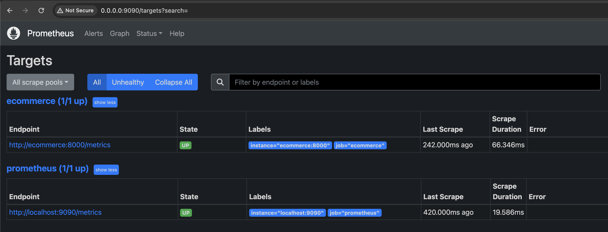
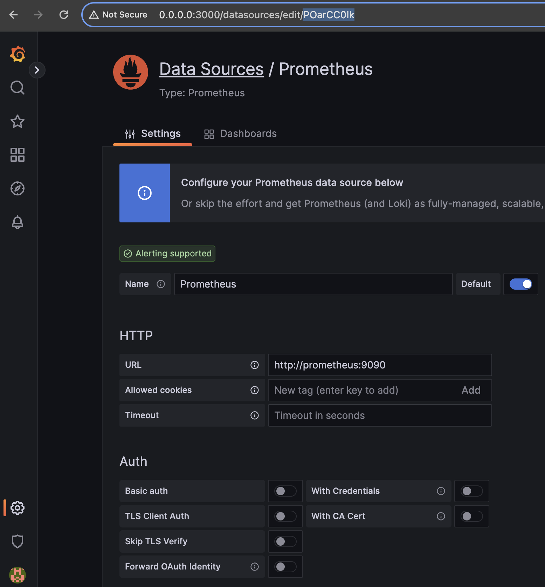

# E-commerce with FastAPI

This project is a personal application developed using FastAPI.
The Ecommerce is created to demonstrate the principles of building APIs,
handling requests, and working with databases. The main goal of the project
is to provide learning opportunities and practice in developing web applications
using modern technologies.

## Key Features

1. **User Management**: Users can register, log in, update their profiles, and
   manage their accounts.
2. **User Profiles**: Users can upload profile pictures and provide a bio to
   personalize their accounts.
3. **Address Management**: Users can add, update, and delete their delivery
   addresses, and set a default address for shipping.
4. **Payment Methods**: Users can add, update, and delete their payment methods,
   including credit/debit cards, and set a default payment method for checkout.
5. **Product Management**: Admins can manage product categories, add new
   products, update product information, and manage product inventory.
6. **Shopping Cart**: Users can add products to their shopping cart, update
   quantities, remove items, and proceed to checkout.
7. **Checkout Process**: Users can review their orders, select a shipping
   method, and make payments securely.
8. **Order Management**: Admins can view and manage orders, update order
   statuses, and track order fulfillment.
9. **Product Reviews**: Users can leave reviews and ratings for products they
   have purchased.

## Database


### Tables:

1. **Users (users):** Stores information about system users, including their
   identifiers, email addresses, passwords, names, surnames, roles, and activity
   statuses.
2. **Roles (roles):** Contains a list of user roles used to manage access within
   the system.
3. **User Profiles (user_profiles):** Contains additional information about user
   profiles, such as photos and biographies.
4. **Addresses (addresses):** Stores information about delivery addresses,
   including street, house number, city, region, postal code, and country.
5. **Address User Relationship (address_user):** Establishes the relationship
   between users and their delivery addresses.
6. **Countries (countries):** Contains a list of countries for organizing
   delivery addresses.
7. **Payment Types (payment_types):** Holds a list of payment types for
   classifying payment methods.
8. **Payment Methods (payment_methods):** Stores information about payment
   methods, including type, provider, and account number.
9. **Product Categories (product_categories):** Stores information about product
   categories for organizing the catalog.
10. **Products (products):** Contains information about products, including
    their names, descriptions, and images.
11. **Product Items (product_items):** Stores information about specific items,
    their prices, and stock levels.
12. **Variations (variations):** Contains information about various product
    variations, such as sizes or colors.
13. **Variation Options (variation_options):** Stores available options for
    product variations.
14. **Product Configurations (product_configurations):** Establishes
    relationships between products and their variations.
15. **Shopping Carts (shopping_carts):** Stores information about user shopping
    carts.
16. **Shopping Cart Items (shopping_cart_items):** Contains information about
    items added to shopping carts.
17. **Shipping Methods (shipping_methods):** Holds information about delivery
    methods available for selection during checkout.
18. **Order Statuses (order_statuses):** Contains a list of order statuses for
    tracking their progress.
19. **Orders (orders):** Stores information about orders placed by users.
20. **Order Lines (order_lines):** Contains information about products ordered
    by users.
21. **User Reviews (user_reviews):** Stores user reviews about ordered products.

## Project structure

```
project/
│
├── docker/
│   ├── app.sh
│   └── celery.sh
│
├── requirements/
│   ├── base.txt
│   ├── dev.txt
│   └── prod.txt
│
├── src/
│   ├── addresses/
│   ├── auth/
│   ├── countries/
│   ├── images/
│   ├── migrations/
│   ├── orders/
│   ├── payments/
│   ├── products/
│   ├── shipping_methods/
│   ├── shopping_carts/
│   ├── static/
│   ├── tasks/
│   ├── tests/
│   ├── users/
│   ├── utils/
│   ├── variations/
│   ├── app.py
│   ├── config.py 
│   ├── conftest.py
│   ├── dao.py
│   ├── database.py
│   ├── examples.py
│   ├── exceptions.py
│   ├── logger.py
│   ├── main.py
│   ├── models.py
│   ├── patterns.py
│   ├── permissions.py
│   └── responses.py
│
├── .black
├── .env-example
├── .flake8
├── .gitignore
├── .isort.cfg
├── .pre-commit-config.yaml
├── Dockerfile
├── alembic.ini
├── docker-compose.yml
├── grafana-dashboard.json
├── prometheus.yml
├── pytest.ini
└── README.md
```

- **docker/:** Directory containing scripts and configurations related to
  Docker.
    - **app.sh:** Shell script for running the Docker application.
    - **celery.sh:** Shell script for managing Celery tasks within Docker.

- **requirements/:** Directory containing dependency files for different
  environments.
    - **base.txt:** Base dependencies for the project.
    - **dev.txt:** Development-specific dependencies.
    - **prod.txt:** Production-specific dependencies.

- **src/:** Directory containing the source code of the project.
    - **addresses/:** Module for handling address-related functionalities.
    - **auth/:** Module for authentication functionalities.
    - **countries/:** Module for managing country data.
    - **images/:** Module for handling image-related functionalities.
    - **migrations/:** Directory for database migration scripts.
    - **orders/:** Module for managing order-related functionalities.
    - **payments/:** Module for handling payment-related functionalities.
    - **products/:** Module for managing product-related functionalities.
    - **shipping_methods/:** Module for managing shipping method
      functionalities.
    - **shopping_carts/:** Module for managing shopping cart functionalities.
    - **static/:** Directory for static files used in the project.
    - **tasks/:** Module for defining background tasks.
    - **tests/:** Directory for storing test modules.
    - **users/:** Module for managing user-related functionalities.
    - **utils/:** Directory for utility modules.
    - **variations/:** Module for managing product variation functionalities.
    - **app.py:** Main application file.
    - **config.py:** Configuration module for the project.
    - **conftest.py:** Configuration for pytest.
    - **dao.py:** Data access object module.
    - **database.py:** Database configuration and connection module.
    - **examples.py:** Module containing example code snippets.
    - **exceptions.py:** Module for defining custom exceptions.
    - **logger.py:** Module for logging functionalities.
    - **main.py:** Main entry point for the application.
    - **models.py:** Module containing data models for the project.
    - **patterns.py:** Module containing design patterns implementations.
    - **permissions.py:** Module for defining user permissions.
    - **responses.py:** Module for defining API response structures.

- **.black:** Configuration file for the Black code formatter tool.
- **.env-example:** Example file with environment variables.
- **.flake8:** Configuration file for the Flake8 code style checking tool.
- **.gitignore:** File specifying patterns to ignore in Git version control.
- **.isort.cfg:** Configuration file for the isort import sorting tool.
- **.pre-commit-config.yaml:** Configuration file for using pre-commit hooks.
- **Dockerfile:** Dockerfile for building a Docker image.
- **alembic.ini:** Configuration file for Alembic, a database migration tool for
  Python.
- **docker-compose.yml:** Docker Compose configuration file for running multiple
  Docker containers.
- **grafana-dashboard.json:** Configuration file for Grafana monitoring
  dashboard in JSON format.
- **prometheus.yml:** Configuration file for the Prometheus monitoring system.
- **pytest.ini:** Configuration file for testing using pytest.
- **README.md:** File containing the project's description.

## Installation and Running

### Installation:

1. Clone the project repository from GitHub:
   ```bash
   git clone https://github.com/zaki-x86/fastapi_ecommerce_api.git
   ```

2. Navigate into the project directory:
   ```bash
   cd fastapi_ecommerce_api
   ```

3. Rename the `.env-example` file to `.env`:
   ```bash
   mv .env-example .env
   ```

4. To configure your application, open the `.env` file in a text editor and fill
   in the appropriate values for each variable based on your environment. Make
   sure to provide valid credentials and configurations, especially for database
   connections, SMTP, and JWT secret key. Once configured, these variables will
   be loaded into your application's environment during runtime.

- **MODE:** Set the mode of your application. You can choose from "DEV", "
  PROD", or "TEST".

- **LOG_LEVEL:** Set the logging level for your application (e.g., "DEBUG", "
  INFO", "WARNING", "ERROR", "CRITICAL").

- **Database Configuration:**
    - **DB_HOST, DB_PORT, DB_USER, DB_PASSWORD, DB_NAME:** Configuration for the
      main database.
    - **POSTGRES_DB, POSTGRES_USER, POSTGRES_PASSWORD:** Configuration for the
      PostgreSQL database (should be the same as DB_NAME, DB_USER and
      DB_PASSWORD respectively).
    - **TEST_DB_HOST, TEST_DB_PORT, TEST_DB_USER, TEST_DB_PASS, TEST_DB_NAME:**
      Configuration for the test database.

- **Redis Configuration:**
    - **REDIS_HOST, REDIS_PORT:** Configuration for the Redis server.

- **SMTP Configuration for sending emails (optional):**
    - **SMTP_HOST, SMTP_PORT:** Configuration for the SMTP server used for
      sending emails.
    - **EMAIL_SENDER_USERNAME, EMAIL_SENDER_PASSWORD:** Credentials for the
      email sender.

- **JWT Secret Key:** Secret key used for JWT (JSON Web Token) authentication.
  You can set your own or peek random secret key
  from https://www.grc.com/passwords.htm

- **Default User Passwords:**
    - **ADMIN_PASSWORD:** Default password for admin users
      (use it for logging as admin. Login: admin@admin.com, password: your
      password for ADMIN_PASSWORD)
    - **USER_PASSWORD:** Default password for regular users.

- **Sentry Configuration:**
    - **SENTRY_URL_NUMBER, SENTRY_PROJECT_NUMBER:** Configuration for
      integrating with Sentry for error tracking. In the `app.py` there
      is `sentry_sdk.init` function to start sentry. Find how to set up your
      sentry project and insert DSN parts of the link to the project to these
      fields. The link will look like:
      https://XXXXXXXXXXXXXXXXXXXXXXXX.ingest.us.sentry.io/XXXXXXXXX

### Running:

To start the project:

1. Make sure Docker and Docker Compose are installed on your system.

2. Run the following command to start the project:
   ```bash
   docker-compose up
   ```

3. Once the containers are up and running, access the Swagger documentation
   at [http://0.0.0.0:8000/docs](http://0.0.0.0:8000/docs) to interact with the
   API.

To stop the project:

1. Press `Ctrl + C` in the terminal to stop the running Docker containers.

2. Run the following command to bring down the Docker containers:
   ```bash
   docker-compose down
   ```

### Running Tests:

If you want to run tests:

To set up the testing environment, you'll need to create a local database and
configure the following variables in your `.env` file:

- **TEST_DB_HOST:** The host address of your local test database.
- **TEST_DB_PORT:** The port number of your local test database.
- **TEST_DB_USER:** The username for accessing your local test database.
- **TEST_DB_PASS:** The password for accessing your local test database.
- **TEST_DB_NAME:** The name of your local test database.

1. Set up and activate a virtual environment:
   ```bash
   python3 -m venv venv
   source venv/bin/activate
   ```

2. Install the required packages:
   ```bash
   pip3 install -r requirements/dev.txt && pip3 install -r requirements/base.txt
   ```

3. Run the tests using pytest:
   ```bash
   pytest
   ```

---

## Usage

Once the application is running, you can access the Swagger documentation by
navigating to http://0.0.0.0:8000/docs in your web browser. Use the Swagger UI
to test the API endpoints and explore the available functionality.

Prometheus and Grafana are automatically started along with the application. If
you want to use it, you need to set it up:

1. Navigate to http://0.0.0.0:9090/targets?search= and verify that both
   prometheus and ecommerce are up:
   
2. You can access Grafana by navigating to http://0.0.0.0:3000 in your web
   browser. Log in to Grafana with the default credentials (username: admin,
   password:
   admin), and configure Prometheus as a data source to start visualizing your
   application metrics.
3. Go to http://0.0.0.0:3000/datasources. Click `Add new data source`.
   Choose
   Prometheus. In HTTP -> URL type `http://prometheus:9090`.
   Click `Save & test.` If you see `Data source is working`, everything
   okay.
4. Find `grafana-dashboard.json` in the root of the project. Replace
   all `POarCC0Ik` with id of your prometheus data source, which is shown in the
   URL of the
   page.
   
5. Go to http://0.0.0.0:3000/dashboards. New -> Import and insert
   updated `grafana-dashboard.json` in `Import via panel json`. Everything
   should work after that
